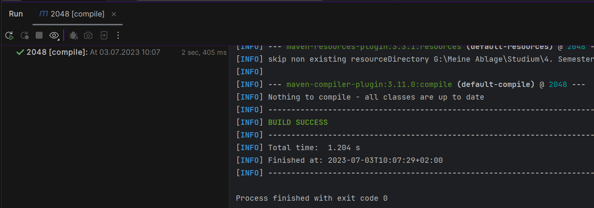
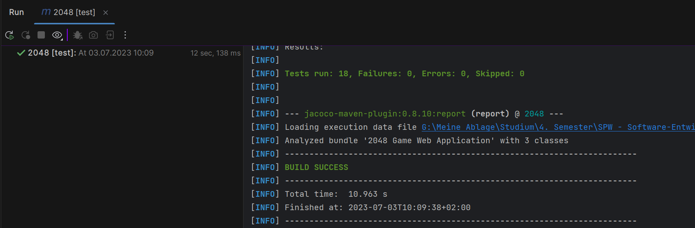
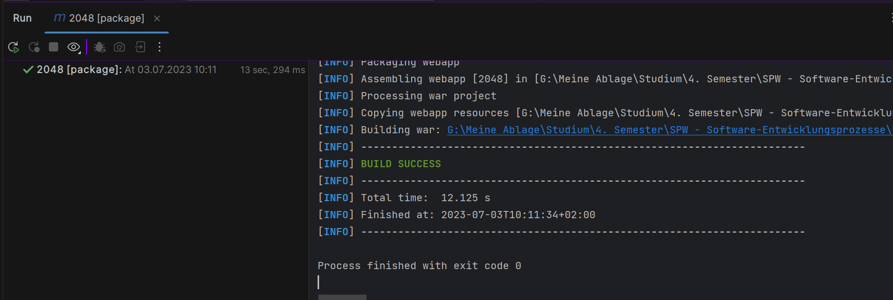

SPW4 - Exercise 3
=================

Name: Patrick Hackl

Effort in hours: 4

## 1. 2048 Web Application and CI/CD Pipeline

### Task 1.a

Done in lesson

### Task 1.b

Done in lesson

### Task 1.c

With the given ReadMe it was easy to setup up a self-hosted
runner. 
The other steps consists of finding out how to do it in GitHub Actions. 
For the deploy a simple move command is used
